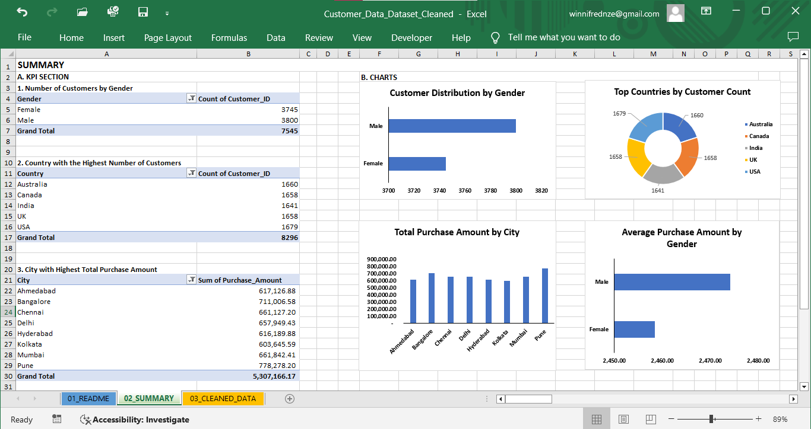
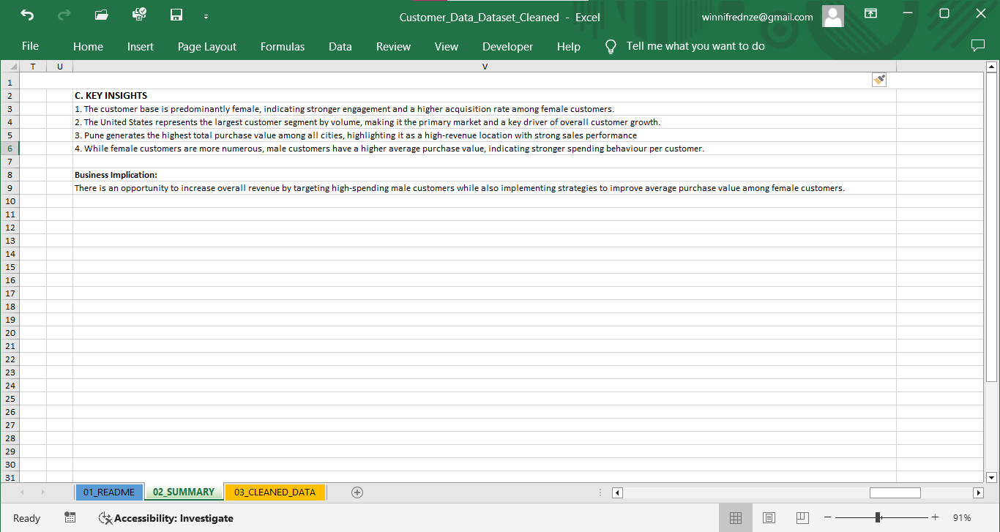

## CUSTOMER BEHAVIOR AND SEGMENTATION ANALYSIS

## Project Overview
This project focuses on cleaning and analyzing customer data to improve data quality and uncover key behavior patterns that can support better business decisions.

## Data Cleaning Steps
- Removed duplicate customer records
- Handled missing values and incomplete entries
- Standardized text fields (names, categories, etc.)
- Corrected inconsistent data formats

## Key Insights
- Customer acquisition is heavily skewed toward female customers, indicating stronger engagement within this segment and potential opportunities for targeted marketing strategies.
- The United States stands out as the primary customer base, contributing the largest share of total customers and playing a central role in overall market growth.
- Despite not having the highest number of customrs, Pune emerges as a key revenue-driving location, suggesting higher spending intensity within that region.
- While female customers dominate in volume, male customers demonstrate higher average spending per transaction, highlighting a valuable high-spend segment with strong revenue potential.

## Tools Used
- Microsoft Excel

## Dashboard Preview

## Dataset
The cleaned dataset is included in this repository.
