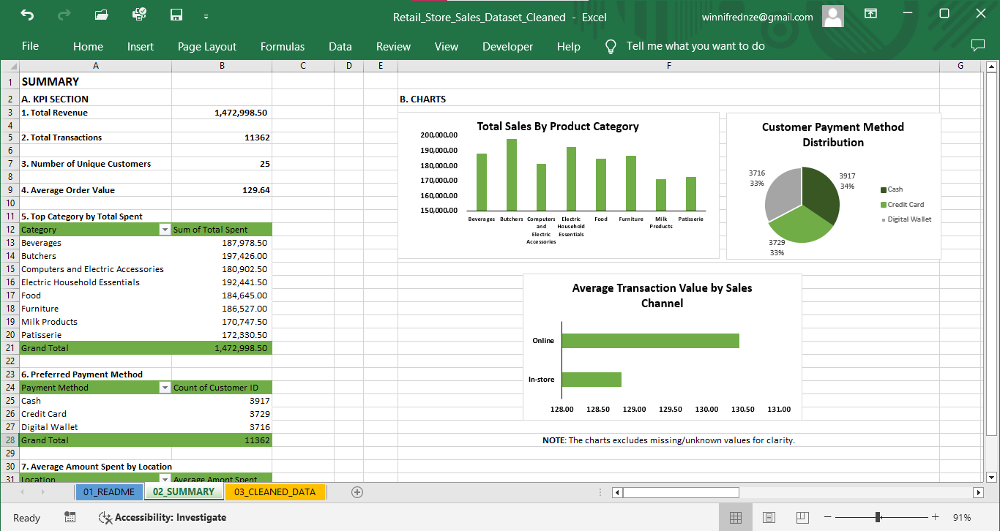
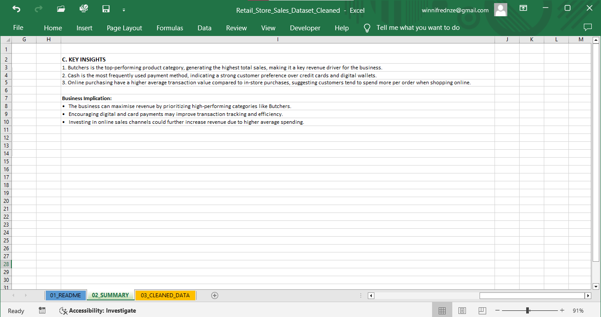

## RETAIL SALES PERFORMANCE ANALYSIS

### Identified Revenue Drivers and Customer Spending Patterns

## Project Overview
This project demonstrates the process of cleaning and preparing a retail sales dataset for accurate analysis and reporting.

## Data Cleaning Process
- Removed duplicates
- Handled missing values
- Standardized formats
- Cleaned date inconsistencies
  
## Key Insights
- Butchers category, generated the highest revenue
- Cash is the most frequently used payment method
- Online purchasing have a higher average spend than in-store purchases

## Tools Used
- Microsoft Excel
  
### Dashboard Preview 

## Dataset
The cleaned dataset is included in this repository.
