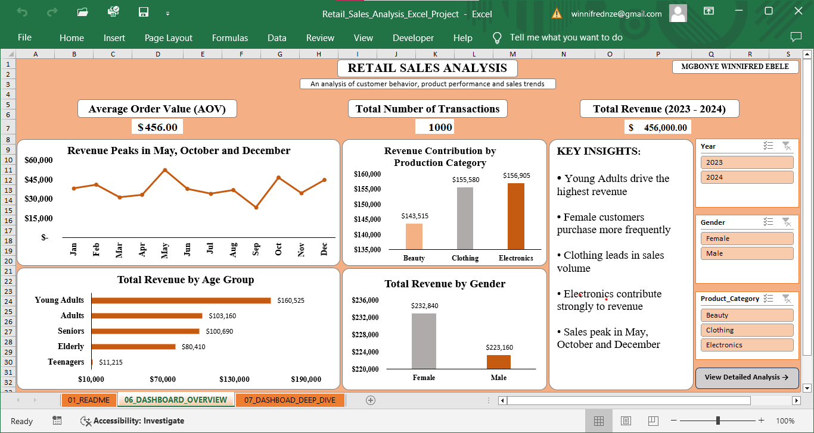

## RETAIL SALES ANALYSIS (EXCEL DASHBOARD PROJECT)
## Overview
This project analyzes retail sales data to uncover patterns in customer behavior, product performance and revenue trends. The goal is to transform raw transactional data into actionable insights using Excel.

## Business Problem
Retail businesses need to understand:
- Who their most valuable customers are
- Which products drive revenue vs volume
- When sales peak and why
- How purchasing behavior differs across segments

This project answers these questions through structured data analysis and interactive dashboards.

## Tools Used
- Microsoft Excel
- Pivot Tables & Pivot Charts
- Data Cleaning & Transformation
- Dashboard Design

## Data Preparation
Key steps included:
- Preserving transaction-level data using Transaction_ID
- Creating derived features:
  - Age Group
  - Quantity Category
  - Month, Year
- Standardizing formats and ensuring data consistency
- Structuring data for pivot-based analysis

## Dashboard Design
### Executive Overview
Provides a high-level summary:
- Total Revenue
- Average Order Value (AOV)
- Total Transactions
- Revenue Trends over Time
- Revenue by Gender and Age Group

### Deep Dive Dashboard
Explores detailed insights:
- Customer behavior (spending & frequency)
- Product category performance
- Revenue per transaction
- Purchase patterns across segments

## Key Insights
- Young Adults are the highest-value customer segment, contributing the most revenue
- Female customers generate higher revenue, driven by higher transaction frequency
- Clothing dominates in the sales volume, indicating strong repeat demand
- Electronics contribute significantly to revenue, suggesting higher-value purchases
- Sales peak during May, October and December, indicating seasonal demand patterns
- Higher transaction sizes correlate with increased customer value

## Business Recommendations
- Target high-value segments (Young Adults) with personalized campaigns
- Optimize inventory for high-demand categories like Clothing
- Leverage seasonal peaks with promotions and marketing campaigns
- Encourage bulk purchases to increase average order value

## Project Structure
- 01_README - Project overview and documentation
- 02_RAW_DATA - Original dataset
- 03_WORKINGS - Data transformation steps
- 04_CLEANED_DATA - Final structured dataset
- 05_PIVOT_TABLES - Supporting Analysis
- 06_DASHBOARD_OVERVEW - Executive dashboard
- 07_DASHBOARD_DEEP_DIVE - Detailed analysis

## Conclusion
This project demonstrates the ability to clean data, build structured analysis and design dashboards that communicate meaningful business insights.
It reflects a practical approach to solving real world business problems using data.

## Dashboard Preview
### Executive Overview

### Deep Dive Analysis

## Dataset
The cleaned dataset is included in this repository.
