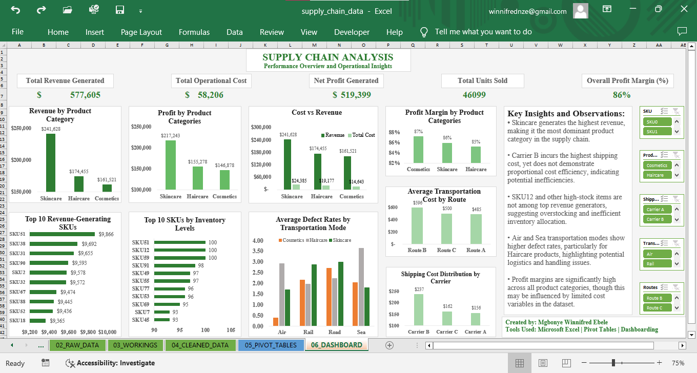

## SUPPLY CHAIN ANALYTICS DASHBOARD

## Project Overview
This project analyzes supply chain operations using Microsoft Excel to uncover insights related to revenue generation, profitability, inventory levels, shipping costs and product defects.

The dashboard was designed to transform raw operational data into meaningful business insights that can support strategic decision-making and supply chain optimization.

## Objectives
The objectives of this analysis were to:
- Evaluate revenue and profit performance across product categories
- Identify top-performing SKUs based on revenue and inventory levels
- Analyze shipping costs and carrier efficiency
- Examine transportation modes associated with higher defect rates
- Monitor overall operational profitability and inventory distribution

## Data Cleaning Process
The following data cleaning steps were performed:
- Removed unnecessary spaces using TRIM function
- Standardized text formatting using PROPER function
- Checked for missing values and duplicates
- Verified data consistency
- Renamed columns using snake_case naming convention
- Assigned appropriate data types
- Created calculated metrics including:
  - Profit
  - Profit_Margin

## Dashboard Features
The dashboard includes:
- KPI Cards
  - Total Revenue
  - Total Cost
  - Net Profit
  - Units Sold
  - Profit Margin
- Interactive slicers for dynamic filtering
- Revenue and profit analysis by product category
- Top-performing SKU analysis
- Cost vs revenue comparison
- Shipping and transportation analysis
- Defect rate analysis across transportation modes

## Key Insights
- Skincare products generated the highest revenue and profit across all product categories
- Carrier B recorded the highest shipping costs, indicating possible operational inefficiencies
- Several high-stock SKUs were not among the highest revenue generators, suggesting overstock risks
- Air and Sea transportation modes showed relatively higher defect rates, particularly for Haircare products
- Profit margins remained high across product categories, although limited cost variables may influence results

## Recommendations
- Optimize logistics operations by evaluating high-cost carriers
- Improve handling and packaging processes for Air and Sea transportation
- Implement inventory optimization strategies to reduce overstocking
- Focus operational and marketing efforts on high-performing product categories

## Limitations
- Revenue values were assumed to be pre-calculated within the dataset
- Limited cost variables may affect the accuracy of profit margin calculations
- Dataset represents a sample operational scenario and may not reflect real-world complexity

## Tools Used
- Microsoft Excel
- Pivot Tables and Pivot Charts
- Slicers
- Calculated Columns
- Dashboard Design Techniques

## Project Structure
- 01_README - Project overview and documentation
- 02_RAW_DATA - Original dataset
- 03_WORKINGS - Data transformation steps
- 04_CLEANED_DATA - Final structured dataset
- 05_PIVOT_TABLES - Supporting analysis
- 06_DASHBOARD - Detailed analysis

## Conclusion
This dashboard demonstrates how data analytics can be used to evaluate operational performance, identify inefficiencies and support data-driven decision-making within supply chain operations.

The project highlights the importance of balancing revenue growth with cost control, inventory optimization and logistics efficiency to improve overall business performance.

## Dashboard

## Dataset
The cleaned dataset is included in this repository.

## Created by:
Mgbonye Winnifred Ebele

