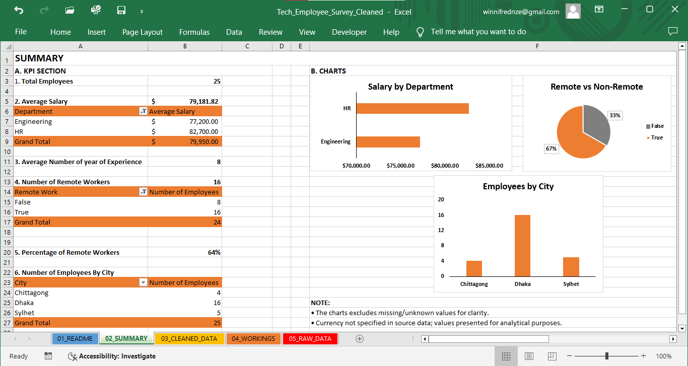
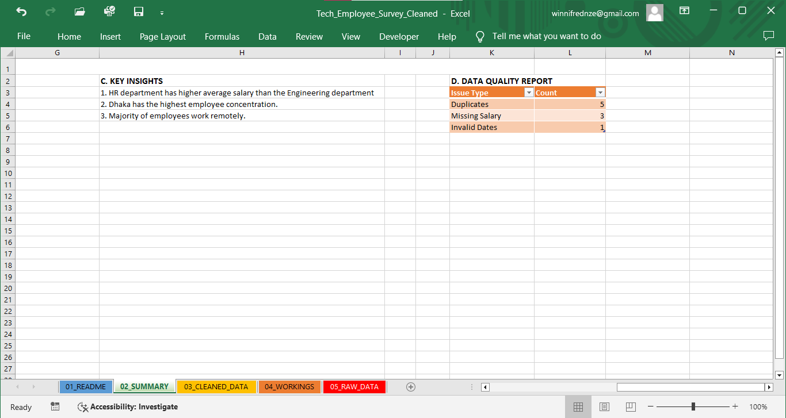

## TECH EMPLOYEE WORKFORCE ANALYSIS
## Project Overview
This project focuses on cleaning and analyzing a tech employee survey dataset to uncover workforce trends, salary insights and workplace patterns.

## Data Cleaning Steps
- Removed duplicate entries
- Handled missing and inconsistent responses
- Standardized salary and categorical fields
- Cleaned and formatted survey response data

## Key Insights
- The HR department records a higher average salary compared to the Engineering department, indicating potential difference in compensation structure across roles.
- Dhaka has the highest employee concentration, suggesting it is a key operational hub for the organization.
- Majority of employees work remotely highlighting a strong shift toward flexible work arrangements within the company.

## Tools Used
- Microsoft Excel

## Dashboard Preview

## Dataset
The cleaned dataset is included in this repository.
